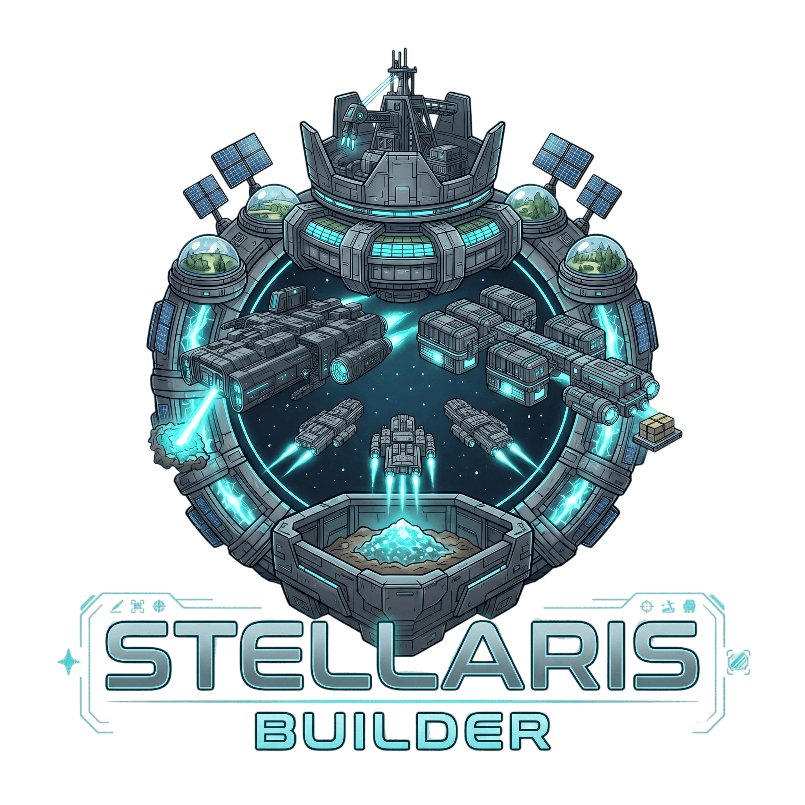

<div align="center">

  

  # STELLARIS BUILDER 2.0
  ### *Ein interstellares Sci-Fi-Aufbau- und Strategiespiel im Browser*

  [](https://angular.dev/)
  [](https://www.typescriptlang.org/)
  [](https://threejs.org/)
  [](https://firebase.google.com/)
  [](https://vitest.dev/)
  [](#lizenz)

  <p align="center">
    <b>Übernimm das Kommando über ein aufstrebendes Sternenreich.</b><br>
    Fördere Ressourcen, meistere komplexe Energiehaushalte, erforsche futuristische Technologien,<br>
    baue eine schlagkräftige Raumflotte auf und verteidige dein Territorium gegen unberechenbare feindliche Raids.
  </p>

  [Funktionen](#-features--spielmechaniken) • [Technologie-Stack](#-technologie-stack) • [Installation & Setup](#-schnellstart--installation) • [Architektur](#-architektur--projektstruktur) • [Spielregeln](#-spielregeln--mechaniken)

</div>

---

## 🌌 Über das Projekt

**Stellaris Builder 2.0** ist ein immersives, browserbasiertes Sci-Fi-Aufbau- und Managementspiel. Es kombiniert klassische Idle-/Incremental-Mechaniken mit strategischem Ressourcenmanagement, Echtzeit-Flottenoperationen und einem dynamischen Kampfsystem.

Das Projekt wurde mit modernstem **Angular 21** (Standalone Components, Signals & Modern Control Flow) umgesetzt und setzt auf visuell beeindruckende **Three.js WebGL-Shader** (inkl. interaktivem 3D-Schwarzen-Loch mit Gravitationslinse und Bloom-Effekt), responsive Sci-Fi-HUD-Grafiken und Cloud-Synchronisation über **Firebase**.

---

## ✨ Features & Spielmechaniken

### ⛏️ Ressourcen & Wirtschaft
* **Primärressourcen:** Kontinuierlicher Abbau von **Eisen**, **Silber** und **Gold** über aufrüstbare Minenanlagen.
* **Spezial- & Sekundärgüter:**
  * **Xenonit:** Seltenes Element, gewonnen durch planetare Raffinerien für Highend-Technologien und schwere Kriegsschiffe.
  * **Personal & Bevölkerung:** Generiert durch orbitale Raumstationen und Kolonisierungsschiffe.
  * **Nahrung:** Versorgungsbasis durch Biolabore und Transportschiffe.
  * **Credits:** Galaktische Währung durch Handelsstationen, interstellare Märkte und Ressourcenbörsen.

### ⚡ Komplexes Energie- & Blackout-System
* **Energieerzeugung:** Solarkraftwerke, Fusionsreaktoren und Antimaterie-Reaktoren mit exponentieller Skalierung.
* **Verbrauch & Instandhaltung:** Jedes Gebäude und jedes Kriegsschiff benötigt konstant Energie.
* **⚠️ Blackout-Mechanik:** Sinkt der Energiehaushalt in den negativen Bereich, **stoppt die Minenproduktion vollständig**, bis neue Energiekapazitäten bereitgestellt werden.

### 🚀 Flottenbau & Weltraumoperationen
* **Zivile Flotten:** Kolonisierungsschiffe, Logistikfrachter und Transporter gewähren permanente Boni auf Lager, Produktion und Versorgung.
* **Asteroiden-Mining:** Entsende spezialisierte Bergbauschiffe (*Mining Ships*) auf zeitkritische Expeditionen zu Asteroidengürteln für massive Sofort-Ressourcen.
* **Militärflotte:** Fertigung von Leichten Jägern, Schweren Jägern, Zerstörern und Schlachtkreuzern.

### ⚔️ Kampfsystem, Feindangriffe & Diplomatie
* **Offensive Raids:** Schicke deine Flotte auf Kampfeinsätze, um Ressourcen und Xenonit als Kriegsbeute (*War Booty*) zu erobern.
* **Feindliche Übergriffe (Raids):** Sobald die erste Offensive gestartet wurde, erwacht eine feindliche Fraktion und attackiert in Intervallen deine Basis!
* **Planetare Verteidigung:** Verringert den Schaden feindlicher Angriffe drastisch (bis zu 85 % Schadensminderung).
* **Diplomatische Deeskalation:** Zahle Tribut über das Diplomatie-Terminal, um Angriffe temporär zu stoppen.

### 🔬 Forschung & Nano-Bot-Schwärme
* **Technologiebaum:** Schalte neue Baumöglichkeiten, Effizienzboni und Schiffsklassen frei.
* **Nano-Bots:** Revolutionäre Technologie, die die globalen Baukosten für Gebäude um bis zu 50 % senkt. Inklusive toggelbarer Partikel-Visualisierung im HUD.

### ⏳ Offline-Fortschritt & Cloud-Save
* **Automatische Offline-Berechnung:** Beim Wiedereinloggen kalkuliert das System akkumulierte Ressourcen, fertiggestellte Gebäude und beendete Flottenmissionen anhand von Zeitstempeln präzise nach.
* **Echtzeit-Synchronisation:** Speicherung aller Fortschritte in Google Cloud Firestore.

### 🪐 Visuelle 3D-Effekte & Sci-Fi HUD
* **3D-Schwarzes-Loch (Three.js):** Eigene GLSL-Shader für Akkretionsscheibe, Gravitationslinseneffekt (Lensing) und Post-Processing-Bloom (`UnrealBloomPass`).
* **Audiovisuelles Design:** Interaktive Raumschiff-Brücke, dynamische Hintergrund-Shader, Soundeffekte und pixelgenaue Retro-Fortschrittsbalken.

---

## 🛠️ Technologie-Stack

| Bereich | Technologien |
| :--- | :--- |
| **Frontend Framework** | [Angular 21](https://angular.dev/) (Signals, Standalone Components, Modern Control Flow) |
| **Programmiersprache** | [TypeScript 5.9](https://www.typescriptlang.org/) |
| **3D Rendering & WebGL** | [Three.js 0.185](https://threejs.org/) (OrbitControls, EffectComposer, UnrealBloomPass, Custom GLSL) |
| **Styling & UI** | SCSS, Custom Sci-Fi Theme & Design Tokens, Custom Cursors, Responsive Layout |
| **Backend & Auth** | [Firebase 12](https://firebase.google.com/) (Firebase Auth: E-Mail/Passwort & Anonymer Gastzugang, Cloud Firestore) |
| **Performance & PWA** | Service Worker (`sw.js`), Custom IndexedDB/Memory `ImageCacheService`, SVG Icon Pipeline |
| **Testing & Tooling** | [Vitest 4](https://vitest.dev/), jsdom, Prettier, Angular CLI 21 |

---

## 🚀 Schnellstart & Installation

### Voraussetzungen
* [Node.js](https://nodejs.org/) (Version `18.x` oder `20.x+` LTS empfohlen)
* [npm](https://www.npmjs.com/) (Version `9.x` oder neuer)

### 1. Repository klonen
```bash
git clone https://github.com/Jan-OliverKaemmererDev/stellaris-builder-2.0.git
cd stellaris-builder-2.0
```

### 2. Abhängigkeiten installieren
```bash
npm install
```

### 3. Firebase konfigurieren
Überprüfe die Firebase-Konfiguration in `src/environments/environment.ts` bzw. `src/environments/environment.development.ts`:
```typescript
export const environment = {
  production: false,
  firebase: {
    apiKey: "DEIN_API_KEY",
    authDomain: "dein-projekt.firebaseapp.com",
    projectId: "dein-projekt",
    storageBucket: "dein-projekt.firebasestorage.app",
    messagingSenderId: "DEINE_SENDER_ID",
    appId: "DEINE_APP_ID"
  }
};
```

### 4. Entwicklungsserver starten
```bash
npm start
# oder
ng serve -o
```
Die Anwendung öffnet sich automatisch unter `http://localhost:4200/`.

---

## 📜 Verfügbare Skripte

| Befehl | Beschreibung |
| :--- | :--- |
| `npm start` | Startet den Angular-Entwicklungsserver mit Hot-Reloading und öffnet den Browser (`ng serve -o`). |
| `npm run build` | Kompiliert das Projekt für die Produktion im Ordner `dist/`. |
| `npm run watch` | Führt einen kontinuierlichen Entwicklungs-Build bei Dateiänderungen aus. |
| `npm test` | Führt die Unit-Tests via [Vitest](https://vitest.dev/) aus. |

---

## 📁 Architektur & Projektstruktur

```text
stellaris-builder-2.0/
├── public/
│   ├── assets/              # Grafiken, Icons, Schiff-Assets & Sounds
│   │   ├── backgrounds/     # Sci-Fi Hintergrundgrafiken
│   │   ├── icons/           # Spiel- und Ressourcen-Icons
│   │   ├── img/             # Modul-Bilder (Mining, Fleet, Energy, ...)
│   │   └── logo.png         # Offizielles Spiel-Logo
│   └── sw.js                # Service Worker für Asset-Caching
├── src/
│   ├── app/
│   │   ├── bridge/          # Kommandozentrale & Übersicht
│   │   ├── components/      # Wiederverwendbare UI- & 3D-Komponenten
│   │   │   ├── black-hole/  # Three.js 3D WebGL Schwarzes Loch
│   │   │   ├── diplomacy-dialog/      # Diplomatie & Friedensverhandlungen
│   │   │   ├── enemy-attack-overlay/  # Benachrichtigung bei Feindangriffen
│   │   │   ├── offline-progress-dialog/# Dialog für Offline-Ressourcenberechnung
│   │   │   ├── pixel-progress-bar/    # Sci-Fi Fortschrittsanzeige
│   │   │   └── user-overlay/          # Spielerprofil & Einstellungen
│   │   ├── guards/          # AuthGuard zum Schutz der Spielrouten
│   │   ├── landing-page/    # Startseite mit Login, Registrierung & 3D-Canvas
│   │   ├── pages/           # Hauptbereiche des Spiels
│   │   │   ├── energy/      # Energieerzeugung & Kraftwerksbau
│   │   │   ├── fleet/       # Raumschiff-Werft & Asteroiden-Missionen
│   │   │   ├── infrastructure/ # Raffinerien, Biolabore & Verteidigung
│   │   │   ├── mining/      # Minen für Eisen, Silber, Gold
│   │   │   ├── research/    # Forschung & Nano-Bot-Entwicklung
│   │   │   ├── rules/       # Ausführliches Regelwerk & Anfängerleitfaden
│   │   │   └── trade/       # Ressourcenmarkt & Handel
│   │   ├── services/        # Business-Logik & State-Management
│   │   │   ├── enemy-attack.service.ts # Raids, Kampflogik & Schadensberechnung
│   │   │   ├── game-math.utils.ts      # Baukostenformeln & Multiplikatoren
│   │   │   ├── game-state.service.ts   # Zentrales State-Management & Persistence
│   │   │   └── image-cache.service.ts  # Caching für schnelle Bildladezeiten
│   │   └── app.routes.ts    # Routen-Konfiguration
│   ├── environments/        # Firebase- & Umgebungs-Konfigurationen
│   └── styles.scss          # Globale Stylesheets & Sci-Fi Design Tokens
├── angular.json             # Angular Workspace Konfiguration
├── package.json             # Projekt-Metadaten & Abhängigkeiten
└── tsconfig.json            # TypeScript Compiler-Konfiguration
```

---

## 📖 Spielregeln & Tipps für den Einstieg

1. **Aller Anfang ist Bergbau:** Errichte zuerst Minen für Eisen, Silber und Gold im Bereich **Mining**.
2. **Energie zuerst absichern:** Jede neue Ausbaustufe benötigt Energie. Baue rechtzeitig Solarkraftwerke im Bereich **Energie**, um Produktionsausfälle durch Strommangel zu vermeiden.
3. **Infrastruktur ausbauen:** Errichte eine **Raffinerie**, um Xenonit zu gewinnen, und **Biolabore**, um Nahrung für deine Crew bereitzustellen.
4. **Asteroiden-Mining nutzen:** Baue Bergbauschiffe und schicke sie auf Expeditionen – sie bringen wertvolle Ressourcen-Schübe in Rekordzeit ein!
5. **Verteidigung nicht vergessen:** Sobald du Feindschiffe angreifst, werden feindliche Flotten auf dich aufmerksam. Baue die **Planetare Verteidigung** aus, um geplünderte Ressourcen bei Angriffen zu minimieren!

---

## 🤝 Mitwirken & Beitragen

Beiträge, Fehlerberichte und Feature-Vorschläge sind jederzeit willkommen!
1. Repository forken (`Fork`).
2. Feature-Branch erstellen (`git checkout -b feature/NeuesFeature`).
3. Änderungen committen (`git commit -m 'feat: Neues Feature hinzufügen'`).
4. Auf den Branch pushen (`git push origin feature/NeuesFeature`).
5. Einen **Pull Request** erstellen.

---

## 📄 Lizenz

Dieses Projekt ist lizenziert unter der **MIT-Lizenz** – siehe die [LICENSE](LICENSE)-Datei für Details.

---

<div align="center">
  <sub>Entwickelt mit Leidenschaft für Sci-Fi & moderne Web-Technologien von <a href="https://github.com/Jan-OliverKaemmererDev">Jan-Oliver Kämmerer</a>.</sub>
</div>
